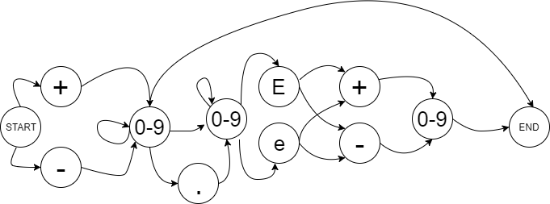
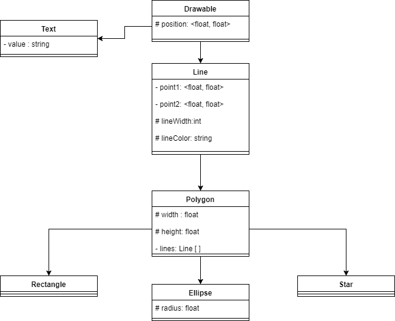
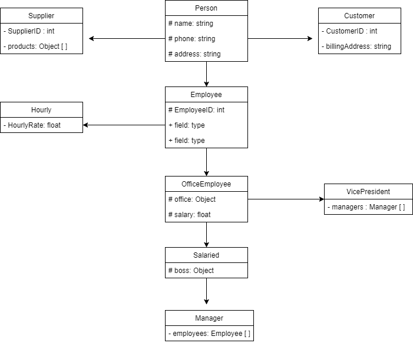
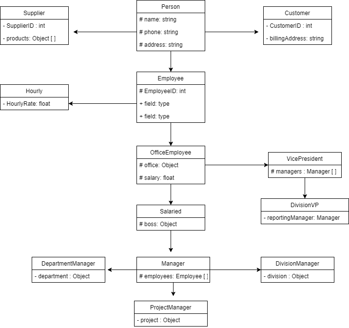

# Assignment 2
#### 5.1)
A component based architecture models the system as a collection of linked components that provide services between each other. A service-oriented architecture is similar except each piece is a self-contained program that run on its own.

#### 5.2)
A monolithic architecture because the application is only used within itself and only has interaction between the player and the program.

#### 5.4)
 A service-oriented architecture so that each player's game is its own self-contained program but still able to communicate with each other to update the game.

#### 5.6)
 The application should use a relational database to keep records of the users and drawings that user created. It should have an audit trail to keep track of changes the users created so that an undo method can be implemented or ability to recover a previous version. Database maintenance should consist of deleting old files that have not recently been open.

#### 5.8)

#### 6.1)
They all share a position, and color property. All classes except Line share a width and height property, as well as a possible fill color. Ellipse is the only class that may have a radius property. The shared classes should be implemented in a parent class such as Line or Polygon, whereas properties that are not shared should be implemented within their own class.

#### 6.2)

#### 6.3)

#### 6.6)
  
