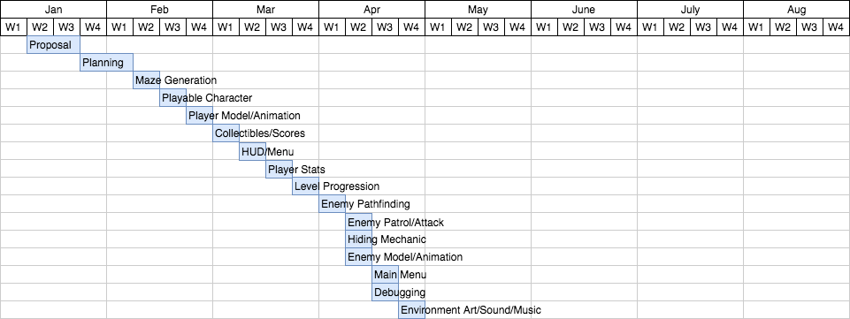

# 4.0 Software Development Plan

## 4.1   Plan Introduction

This Software Development Plan (SDP) provides the details of the scheduled development for the video game, Ghost Labyrinth.
Ghost Labyrinth is a horror themed third-person 3-D puzzle game that utilizes random maze generation so that each game is a different experience.

During my 16 week development process, having little to no knowledge of game development, its cycle and Unity's core engine, I have been referring to various online resources and YouTube videos in order to implement the game as much as possible.

As part of the development the following features will be completed:

| Function / Feature | Due Date |
|---|---|
| Random Maze Generation | Week 4 |
| Playable Character | Week 5 |
| Player's model and animation| Week 6 |
| Collectible/Score System | Week 7 |
| Heads Up Display / UI Menus | Week 8 |
| Player Statistics | Week 9 |
| Infinite Level Progression | Week 10 |
| Enemy Pathfinding | Week 11 |
| Enemy Patrol / Attack | Week 12 |
| Hiding Mechanic | Week 12 |
| Enemy model and animation | Week 12 |
| Main Menu | Week 13 |
| Debugging | Week 13 |
| Environment Art | Week 14 |
| Sound Effects | Week 14 |
| Game Music | Week 14 |
| Tweaks and Optimization | Week 15 |

- 4.1.1 Project Deliverables
  - Alpha (3/19/2018) - The alpha version of Ghost Labyrinth will have a playable character, a randomly generated level and game progression by collectible scattered objects.
  - Beta (4/02/2018) - The beta version of Ghost Labyrinth will have the enemy AI, along with various UIs and death mechanic to cause a game over if player gets attacked too many times.
  - Version 1.0 (4/27/2018) - Version 1.0 will include all features with minimum bugs and game art.

## 4.2   Project Resources

- 4.2.1 Hardware Resources

| Resource | Development | Execution |
|---|---|---|
| Macbook/Windows Computer | ✓ | ✓ |
| Intel HD Graphics 4600 Graphics Card | ✓ | ✓ |
| 8 GB RAM | ✓ | ✓ |
| Internet Connectivity | ✓ | ✓ |
| 16 GB Storage | ✓ | ✓ |

- 4.2.2 Software Resources

|Resource              | Development   | Execution  |
|--------------------- | ------------- | -----------|
|Unity 5.6        | ✓             | ✓         |
|Visual Studio      | ✓             |    ✓        |
|JetBrains Rider       | ✓             | ✓             |
|macOS                 | ✓             | ✓         |
|Windows OS            | ✓             | ✓         |
|GitHub                | ✓             |           ||

## 4.3   Project Organization
I have divided Ghost Labyrinth into four main stages that need to be accomplished throughout: Planning, Game Development, User Interface Development, and Game Art.

### 4.3.1 Planning:
- Planning will begin as soon as the project proposal has been approved and will continue until all aspects of gameplay, art, and UX design has been thoroughly thought of.

### 4.3.2 Game Development:
- Most of my time will be invested in this stage, which involves actual gameplay implementation. This spans from level generation, controls, enemy AI, stat tracking and much more.

### 4.3.3 User Interface Development:
- This stage will be implemented concurrently with game development as it involves the state of the game to remain updated and accurate. Menus, buttons and trackers will all be implemented within this stage.

### 4.3.4 Game Art:
- The last of my project after the game works as intended will be cosmetics and sound. This involves animation, character models, textures and sound effects. The least of my priorities, but a strong goal.

## 4.4   Project Schedule

- 4.4.1 PERT / GANTT Chart

- 4.4.2 Task / Resource Table

| Task| Resource(Hardware/Software) |
|---|---|
|Planning|Google Doc|
|Maze Generation| Unity, Visual Studio, JetBrains Rider, (Mac/Windows)|
|Player Implementation| Unity, Visual Studio, JetBrains Rider, (MacWindows)|
|Collectible / Score | Unity, Visual Studio, JetBrains Rider, (Mac/Windows)|
|HUD / Menus| Unity, Visual Studio, JetBrains Rider, (Mac/Windows)|
|Enemy Implementation| Unity, Visual Studio, JetBrains Rider, (Mac/Windows)|
|Game Art| Unity, Miximo, (Mac/Windows)|
|Sound Efects| Unity, FreeSound, (Mac/Windows)|
