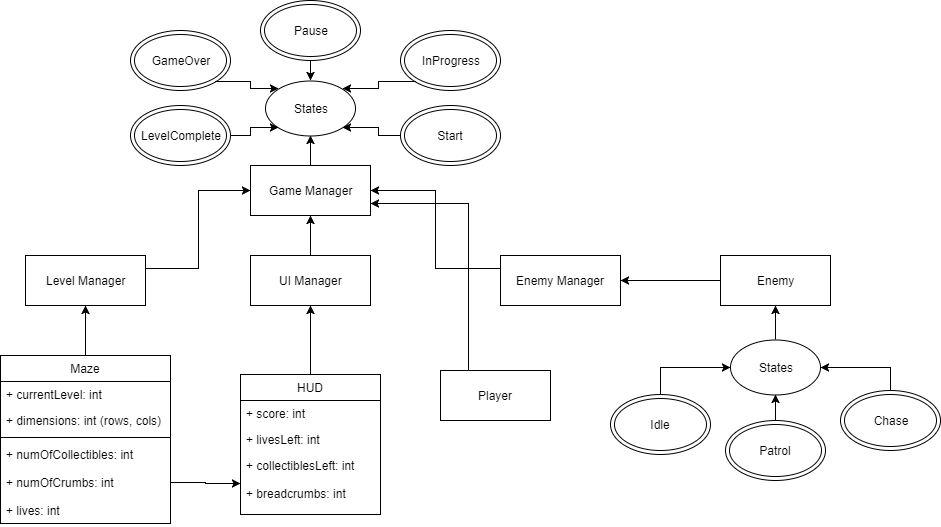

# Software Requirements Specification
## 5.1 INTRODUCTION
This Software Requirements Specification (SRS) outlines the requirements for the game, Ghost Labyrinth. Ghost Labyrinth is an arcade inspired maze game that follows similar mechanics as Pac-Man to a more modern approach. My focus is to create a suspenseful environment as players traverse a poorly lit maze in search of collectibles to pass the level while avoiding the enemies patrolling the maze. With only 3 lives, the goal is to advance as far as one can before getting game over and setting a new high score. This game will be developed in Unity's game engine and will be written in C#.

## 5.2 FUNCTIONAL REQUIREMENTS
- 5.2.1 ** Maze Level Design **
    - 5.2.1.1 The maze shall be procedurally randomly generated based on level.
    - 5.2.1.2 The maze shall be enclosed.
    - 5.2.1.3 The maze shall contain no loops or open areas.
    - 5.2.1.4 The maze shall increase in size based on progression.
    - 5.2.1.5 The maze shall contain collectibles dispersed throughout.
    - 5.2.1.6 The maze shall be traversable by player and enemy AI.
    - 5.2.1.7 The maze will contain material and texture art.
    - 5.2.1.8 The maze will contain ambient sound.
- 5.2.2 ** Player Interaction **
    - 5.2.2.1 The player shall be able to move the protagonist around.
    - 5.2.2.2 The player shall be able to see a limited radius of visibility.
    - 5.2.2.3 The player shall be able to place limited "breadcrumbs" throughout the maze.
    - 5.2.2.4 The player shall be notified when an enemy is in pursuit.
    - 5.2.2.5 The player shall be able to hide to avoid enemies in pursuit.
    - 5.2.2.6 The player shall be able to pick up collectibles.
    - 5.2.2.7 The player shall be able to pause the game.
    - 5.2.2.8 The player shall be able to exit the game.
- 5.2.3 ** Enemy Manager **
    - 5.2.3.1 The Enemy Manager shall be able to transfer player data to enemy instances.
    - 5.2.3.2 The Enemy Manager shall be able to transfer maze data to enemy instances.
    - 5.2.3.3 The Enemy Manager shall be able to instantiate an Enemy.
        - 5.2.3.3.1 An enemy shall be able to patrol the maze.
        - 5.2.3.3.2 An enemy shall be able to idle until next destination is determined.
        - 5.2.3.3.3 An enemy shall be able to chase the player.
        - 5.2.3.3.4 An enemy shall be able to attack the player.
        - 5.2.3.3.5 An enemy shall be able to lose a player upon hiding.
        - 5.2.3.3.6 An enemy shall be able to transition between various states.
        - 5.2.3.3.7 An enemy shall be able to faintly glow.
        - 5.2.3.3.8 An enemy shall be able to only see in forward direction.
        - 5.2.3.3.9 An enemy shall not be able to see through walls.
        - 5.2.3.3.10 An enemy shall be able to pass through other Enemies.
- 5.2.4 ** User Interface Manager **
    - 5.2.4.1 The User Interface Manager shall be able to handle the Heads Up Display (HUD)
        - 5.2.4.1.1 The HUD shall be visible while game is in progress.
        - 5.2.4.1.2 The HUD shall display the player's current score.
        - 5.2.4.1.3 The HUD shall display the number of lives the player has left.
        - 5.2.4.1.4 The HUD shall display the number of collectibles remaining to collect.
        - 5.2.4.1.5 The HUD shall display the number of "breadcrumbs" left in stock.
    - 5.2.4.2 The User Interface Manager shall be able to handle the Pause Menu.
        - 5.2.4.2.1 The Pause Menu shall be displayed when the game is in a pause state.
        - 5.2.4.2.2 The Pause Menu shall have a "resume" button to continue gameplay.
        - 5.2.4.2.3 The Pause Menu shall have an "exit" button to exit game.
    - 5.2.4.3 The User Interface Manager shall be able to handle the Game Over Menu.
        - 5.2.4.3.1 The Game Over Menu shall be displayed when a player has lost the game.
        - 5.2.4.3.2 The Game Over Menu shall display the current level the player reached.
        - 5.2.4.3.3 The Game Over Menu shall display the player's current score.
        - 5.2.4.3.4 The Game Over Menu shall have a "retry" button.
        - 5.2.4.3.5 The Game Over Menu shall have an "exit" button.
        - 5.2.4.3.6 The Game Over Menu will display the player's high score.
        - 5.2.4.3.7 The Game Over Menu will notify the player if previous high score was beaten.
- 5.2.5 ** Game Manager **
    - 5.2.5.1 The Game Manager shall be able to handle transition of various game states.
    - 5.2.5.2 The Game Manager shall allow communication between sub-managers.
    - 5.2.5.3 The Game Manager shall encapsulate all game data.

## 5.3 PERFORMANCE REQUIREMENTS
    - 5.3.1 The protagonist shall react instantly to player's input.
    - 5.3.2 The HUD shall update instantly upon change in game state.
    - 5.3.3 The enemy shall calculate a path to destination in less than 5 seconds.
    - 5.3.4 The maze shall randomly generate in less than 5 seconds.
    - 5.3.5 The game shall pause instantly upon player's input.
    - 5.3.6 The game shall restart and clear all data upon player's input in less than 2 seconds.

## 5.4 ENVIRONMENT REQUIREMENTS
###  5.4.1 DEVELOPMENT ENVIRONMENT REQUIREMENTS
Hardware Requirements

| Category | Requirement|
|----------|------------|
| CPU | Intel Core i7 3.6 GHz |
| Graphics Card | Intel HD Graphics 4600 |
| RAM | 16 GB|

Software Requirements

| Category | Requirement |
|----------|-------------|
| Engine   | Unity 5.6 or higher|
| Editor | MonoDevelop 5.9.6 or higher|

### 5.4.2 EXECUTION ENVIRONMENT Requirements
| Category | Requirement |
|----------|-------------|
| Operating System | Windows 10 / Mac OSX / Linux|
